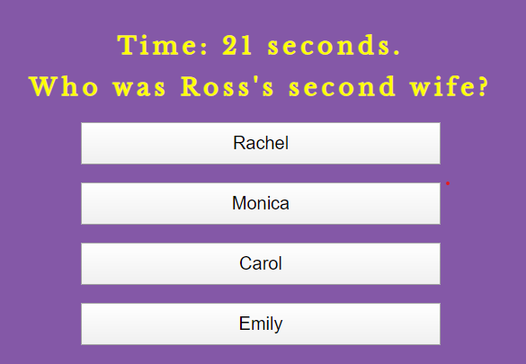

# TriviaGame

## How to play:
There are a total of 8 questions. It is timed with 30 seconds to answer each question. Press start button the start the game.

**Correct answer is selected**, then an image and the "Correct" message will show.  
**Incorrect answer is selcted**, then a message of, "Incorrect" will show, the correct answer and its image will display.  
**If timer goes to 0**, then a message of, "Time's up" will show. It'll also show the image and correct answer.    

At the end, it will show how many questions were correct, incorrect, and missed. It'll give an option to press Start button again to play another round. 

Try it out: https://mhvue.github.io/TriviaGame  

This applicaiton is built with Javascript, jQuery, HTML5 and CSS. 
